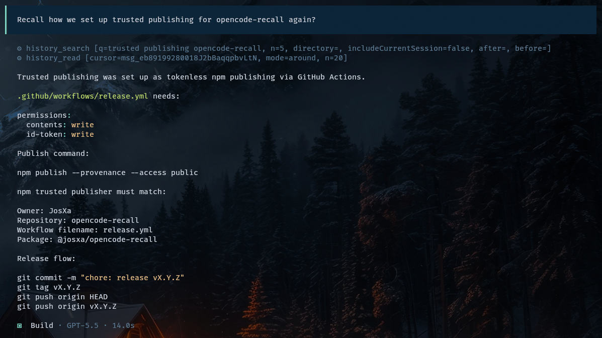
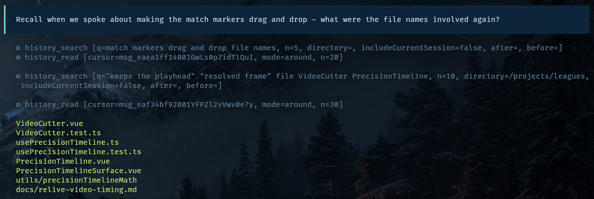

# @josxa/opencode-recall

[](https://www.npmjs.com/package/@josxa/opencode-recall)
[](https://github.com/JosXa/opencode-recall/actions/workflows/ci.yml)
[](./LICENSE)

> 🧠 **Searchable memory for [OpenCode](https://opencode.ai).** Ask *"what did we figure out about X last month?"* and the agent actually finds it.

Every OpenCode session is already saved locally. Recall makes them searchable, so the agent can pull the right slice of a past conversation back into context on demand, instead of you re-explaining yourself or dumping whole sessions into the prompt.

```text
        you ask                                you (or the agent) follow up
   "what did we figure out                  "show me more around that one"
    about rate limiting?"                   "what came right before?"
            │                                            │
            ▼                                            ▼
   ┌────────────────────┐    hits + cursors    ┌──────────────────────────┐
   │   search history   │ ───────────────────► │   ranked snippets        │
   └────────────────────┘                      └────────────┬─────────────┘
                                                            │
                                                    pick a cursor
                                                            │
                                                            ▼
                                          ┌────────────────────────────────┐
                                  ┌─────► │   read transcript              │
                                  │       └────────────────┬───────────────┘
                                  │                        │
                                  │            transcript + cursors
                                  │                        │
                                  │                        ▼
                                  │       ┌────────────────────────────────┐
                                  └────────┤   pull surrounding messages   │
                                next page  │   (ChatML)                    │
                                           └───────────────────────────────┘
```

## Why Recall?

You've already solved this problem. You debugged this exact error six weeks ago in another project. You worked out the deploy steps in a session you can't find anymore. The knowledge is *there*, sitting in `opencode.db`, but the agent can't see it.

Recall fixes that:

🔎 **Find the right session in seconds.** Hybrid lexical + semantic search across every project you've used OpenCode in.

📜 **Read the actual conversation, not a summary.** The agent pages a bounded window of messages around the match. Tool calls, patches, and file attachments render as structured ChatML, not a wall of JSON.

🎯 **Explicit by design.** Recall doesn't auto-inject memories. You (or the agent, when you ask) decide when to search. Your context window stays lean and you always know why something showed up in the prompt.

🔒 **Local and read-only.** Your `opencode.db` is never written to. The embedding index lives in a sidecar SQLite file you can delete any time.

## What it looks like

**Simple recall: "remind me how we did this."**



**Iterative recall: agent reformulates the search when the first pass is thin.**



## Install

```sh
opencode plugin @josxa/opencode-recall -gf
```

This installs the package and wires it into your global OpenCode config.

<details>
<summary>Manual installation</summary>

```sh
bun add -d @josxa/opencode-recall
```

Then register the plugin in `opencode.json` or `~/.config/opencode/opencode.json`:

```jsonc
{
  "$schema": "https://opencode.ai/config.json",
  "plugins": ["@josxa/opencode-recall"]
}
```

</details>

## Set up embeddings (Ollama)

Semantic search uses [Ollama](https://ollama.com) running locally. Install it, that's it:

```sh
ollama --version  # should print a version. install from https://ollama.com/download if not.
```

Everything else is handled for you. The first `history_search` call will start `ollama serve` if it isn't running, pull the default embedding model (`all-minilm`, small and fast) if it isn't installed, and build the sidecar index incrementally. Subsequent calls reuse and sync it.

Lexical search still works without Ollama, but you lose paraphrase recall, which is half the value.

## How to actually use it

Recall is explicit. The agent searches when you ask it to. Some prompts that work well:

- *"Recall how we set up the GitHub Actions release workflow."*
- *"Did we ever debug the Postgres connection pool exhaustion? Find that conversation."*
- *"Pull up the session where we discussed the rate limiter design."*
- *"Search my history for anything about Figma MCP and Azure."*
- *"What were the file names involved when we worked on the timeline component?"*

The agent runs `history_search`, picks a promising hit, calls `history_read` to load the surrounding messages, and can page forward or back if more context is needed.

## Configuration

Recall creates a config file automatically on first use:

```text
<opencode-config-base-path>/recall.jsonc
```

On a normal Linux/macOS setup that is `~/.config/opencode/recall.jsonc`.

Most users never need to edit it. Open it when your OpenCode database lives somewhere unusual, you want the sidecar index somewhere else, or you want to try a different embedding model.

```jsonc
{
  "database": {
    // OpenCode session database. Opened read-only; recall never writes here.
    // Default: ~/.local/share/opencode/opencode.db
    "path": "~/.local/share/opencode/opencode.db",

    // Sidecar embedding index. Safe to delete; rebuilt on next search.
    // Default: ~/.local/share/opencode/opencode-recall-index.db
    "indexPath": "~/.local/share/opencode/opencode-recall-index.db"
  },

  "embeddings": {
    // Ollama base URL.
    // Default: http://127.0.0.1:11434
    "ollamaUrl": "http://127.0.0.1:11434",

    // Try "mxbai-embed-large" for higher quality at the cost of speed and memory.
    // Default: all-minilm
    "model": "all-minilm"
  }
}
```

Environment variables still work as overrides for CI, MCP, and temporary experiments: `OPENCODE_DB_PATH`, `OPENCODE_RECALL_DB_PATH`, `OPENCODE_RECALL_OLLAMA_URL`, and `OPENCODE_RECALL_EMBED_MODEL`.

Run `bun run eval:embeddings` to compare installed embedding models against the local regression cases in [`docs/real-history-regressions.md`](./docs/real-history-regressions.md).

## Tool reference

Recall exposes two tools to the agent.

<details>
<summary><code>history_search</code>: return ranked hits for a query</summary>

| Arg      | Type     | Notes                                                                                                  |
| -------- | -------- | ------------------------------------------------------------------------------------------------------ |
| `q`      | string   | **Required.** Free-text query.                                                                         |
| `n`      | number   | Max hits (default `8`, max `25`).                                                                      |
| `dir`    | string   | Exact OpenCode session directory filter.                                                               |
| `after`  | ISO date | Only messages at or after this timestamp.                                                              |
| `before` | ISO date | Only messages at or before this timestamp. Defaults to *now − 30 s* to exclude the live conversation.  |

Returns a JSON array of compact hits:

```jsonc
[
  {
    "cursor": "msg_…",     // opaque; pass to history_read
    "sid":    "ses_…",     // OpenCode session id
    "dir":    "/Users/you/projects/foo",
    "title":  "Figma MCP server on Azure API Center",
    "time":   "2026-04-12T08:21:44.000Z",
    "role":   "assistant",
    "score":  0.7421,
    "text":   "…snippet capped at 280 chars…"
  }
]
```

</details>

<details>
<summary><code>history_read</code>: read a bounded transcript window around a cursor</summary>

| Arg      | Type   | Notes                                                                                          |
| -------- | ------ | ---------------------------------------------------------------------------------------------- |
| `cursor` | string | **Required.** A `msg_…`, a `ses_…`, or an encoded cursor from `history_search`.                |
| `mode`   | string | `around` (default), `next`, `prev`, `head`, `tail`, or `full`.                                 |
| `n`      | number | Message count. Default `12`, max `50`. For `full`, default `200`, max `500`.                   |

Returns a ChatML-like transcript window:

```xml
<hist sid="ses_…" dir="/…" mode="around" range="42-53" anchor="48" total="120" title="…">
<|im_start|>user name="msg_…" index="42" time="2026-04-12T08:21:44.000Z"
…text and tool_call blocks…
<|im_end|>
…more messages…
<nav cur="…" prev="…" head="…" next="…" tail="…" full="…" />
</hist>
```

Tool calls, patches, and file attachments render as structured tags with explicit `truncated` / `original_chars` markers when content is capped. The `<nav/>` element gives the agent cursors to keep paging without re-searching.

</details>

## How it works

```text
┌───────────────────┐    history_search    ┌──────────────────────┐
│     OpenCode      │ ───────────────────► │  Ranked anchors      │
│                   │                      │  (opaque cursors)    │
└───────────────────┘ ◄─────────────┐      └──────────┬───────────┘
         │      history_read        │                 │
         ▼                          │ ChatML window   │
┌───────────────────┐   pagination  │                 │
│  ChatML window    │ ◄─────────────┘                 │
│  with <nav/>      │                                 │
└───────────────────┘                                 │
                                                      ▼
                                     ┌──────────────────────────────┐
                                     │  opencode.db   (read-only)   │
                                     │  + sidecar embedding index   │
                                     └──────────────────────────────┘
```

- **Source of truth.** `opencode.db` is opened read-only. The plugin never writes to it.
- **Sidecar index.** A separate SQLite database (`opencode-recall-index.db`) stores text chunks, content hashes, and `Float32` embedding blobs. Synthetic `session-title:<id>` rows are indexed so proper-noun title queries beat noisy snippet matches.
- **Sync.** Each `history_search` call performs an incremental sync with a 30-minute overlap window and a lock so concurrent agents don't fight. Stale rows are pruned by comparing part ids.
- **Ranking.** Lexical and semantic candidates are merged, scored with title/text/directory term ratios plus phrase boosts, filtered to require enough query-term overlap, and diversified to at most two hits per session. A small semantic-rescue lane admits paraphrase matches that miss lexical filters but have high embedding similarity.
- **Reads.** Windows are computed by `row_number()` over `(session_id, time_created, id)`, then parts are normalized into `text | tool | patch | file` and capped (tool input 2 000 chars, output 6 000 chars).

## Development

```sh
bun install
bun run ai:check           # biome + tsgo type-check
bun test                   # deterministic ranking + cursor tests
bun run eval:real-history  # regression suite against your local opencode.db
bun run build              # emits dist/
```

Code quality is enforced by `biome` and `tsgo --noEmit`. See [`AGENTS.md`](./AGENTS.md) for the style guide.

## License

[MIT](./LICENSE) © JosXa
